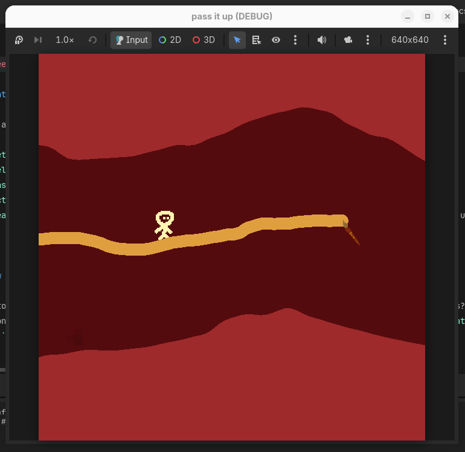

# kinda like linerider ig

## what is it?

a game where you uh a ride lines or sumn idk.
---

## how to play?

mouse left click draws the line. keep your player on the line and don't let it fall or touch the walls.

---

## how to build?

just clone the repo, open it in godot and export it.

---

## ai usage

ai was occasionally used, that is, we just asked chatgpt/claude sometimes. no ai autocompletion was used.
